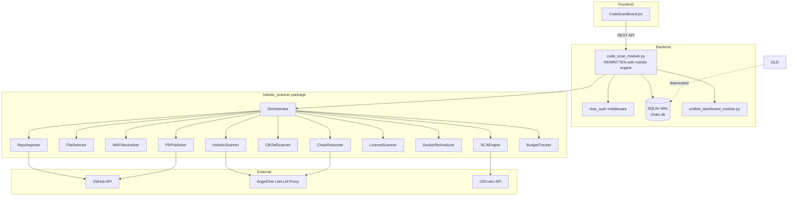
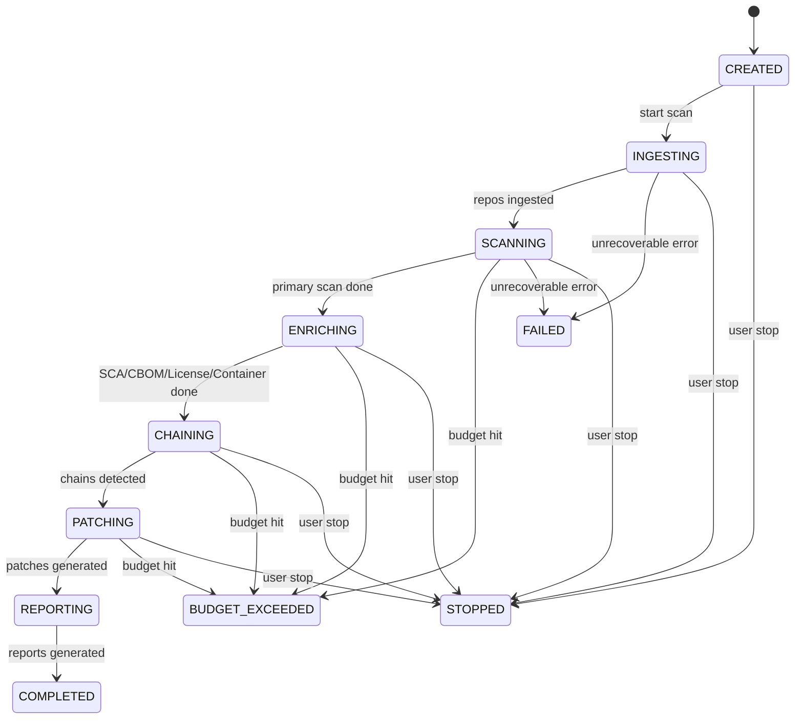
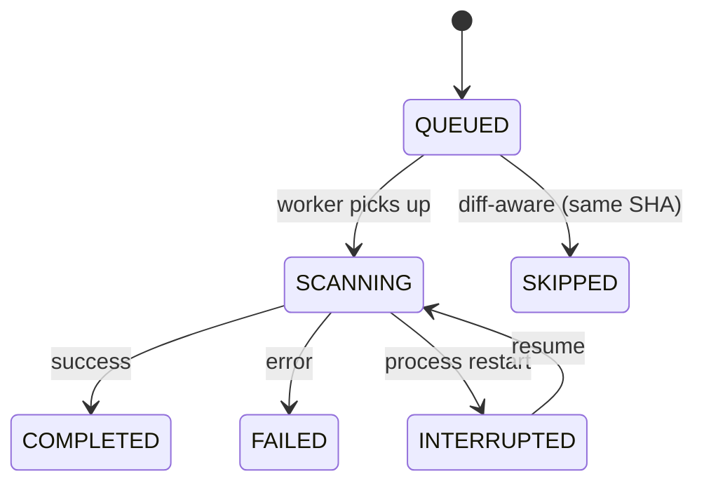

# Design Document: Holistic Code Scanner Integration

## Overview

This design describes the integration of the Holistic Scanner V2 engine into the Angela platform, replacing the legacy chunk-based code scanning pipeline. The scanner provides full-context single-call repository analysis achieving 100% recall at ~$1.17/repo. The integration adds multi-repo orchestration, SBOM generation, cryptographic BOM, SCA with reachability, cross-repo exploit chain detection, auto-PR remediation, license compliance, container analysis, budget enforcement, and resumable scan state — all exposed via the **same** `code_scan_module.py` FastAPI router (rewritten in-place) and the **same** `CodeScanBoard.jsx` React component (updated with new tabs).

### Key Design Decisions

1. **Import-as-package**: The holistic scanner at `backend/CodeScanning/New project/holistic_scanner/` is imported by adding its parent directory to `sys.path`. No code duplication.
2. **In-place replacement**: The existing `backend/code_scan_module.py` is **replaced** (not deprecated) by rewriting its internals to use the holistic scanner orchestrator. The same file name, same router prefix `/api/code-scan/`, and same `CodeScanBoard.jsx` frontend are reused — no parallel modules.
3. **Schema extension**: Existing `code_scans` and `code_scan_findings` tables are extended with new columns. New tables store SBOM, SCA, chains, licenses, container findings, and PR results.
4. **Unified Dashboard push**: On scan completion, findings are pushed to the unified dashboard with `finding_type` distinguishing sast/sca/cbom/container/chain.
5. **RBAC via existing middleware**: All endpoints use the existing `require_module("code_scan")` guard with Admin/Agent/Viewer differentiation.
6. **Same frontend file**: `CodeScanBoard.jsx` is updated in-place with new tabs and multi-repo input — same component, same route.

## Architecture

### High-Level Architecture Diagram



### Scan Lifecycle State Machine



### Per-Repo State Machine



## Components and Interfaces

### Backend Components

| Component | File | Responsibility |
|-----------|------|----------------|
| `code_scan_module.py` | `backend/code_scan_module.py` (REWRITTEN) | FastAPI router exposing all `/api/code-scan/` endpoints, wrapping holistic scanner |
| `Orchestrator` | `holistic_scanner/core/orchestrator.py` | Coordinates multi-repo scan lifecycle |
| `RepoIngester` | `holistic_scanner/core/repo_ingester.py` | Downloads repos via GitHub API or zip upload |
| `FileSelector` | `holistic_scanner/core/file_selector.py` | Security-first file prioritization |
| `WAFNeutralizer` | `holistic_scanner/core/waf_neutralizer.py` | Defangs WAF-triggering patterns |
| `HolisticScanner` | `holistic_scanner/core/holistic_scanner.py` | Core single-call LLM scan |
| `SCAEngine` | `holistic_scanner/core/sca_engine.py` | OSV.dev lookup + reachability |
| `CBOMScanner` | `holistic_scanner/core/cbom_scanner.py` | Cryptographic algorithm detection |
| `ChainReasoner` | `holistic_scanner/core/chain_reasoner.py` | Cross-repo exploit chain detection |
| `LicenseScanner` | `holistic_scanner/core/license_scanner.py` | License classification |
| `DockerfileAnalyzer` | `holistic_scanner/core/dockerfile_analyzer.py` | Container misconfiguration detection |
| `PRPublisher` | `holistic_scanner/core/pr_publisher.py` | Auto-PR generation |
| `BudgetTracker` | `holistic_scanner/core/budget_tracker.py` | Cost tracking and enforcement |

### API Endpoints

All endpoints are prefixed with `/api/code-scan/` and protected by RBAC middleware.

| Method | Path | Access | Description |
|--------|------|--------|-------------|
| POST | `/scans` | Admin, Agent | Start a new scan |
| GET | `/scans` | All | List scans |
| GET | `/scans/{id}` | All | Scan details with per-repo status |
| GET | `/scans/{id}/findings` | All | Paginated findings |
| GET | `/scans/{id}/sbom/{repo}` | All | CycloneDX SBOM for a repo |
| GET | `/scans/{id}/sca/{repo}` | All | SCA/CVE results |
| GET | `/scans/{id}/cbom/{repo}` | All | Crypto BOM results |
| GET | `/scans/{id}/chains` | All | Exploit chains |
| GET | `/scans/{id}/licenses/{repo}` | All | License compliance |
| GET | `/scans/{id}/container/{repo}` | All | Container findings |
| GET | `/scans/{id}/prs` | All | Auto-PR status |
| GET | `/scans/{id}/budget` | All | Cost metrics |
| GET | `/scans/{id}/export` | All | Export (format=json\|sarif\|md\|html) |
| POST | `/scans/{id}/resume` | Admin, Agent | Resume interrupted scan |
| POST | `/scans/{id}/stop` | Admin, Agent | Stop running scan |
| DELETE | `/scans/{id}` | Admin | Delete scan |
| GET | `/config` | Admin | Get platform defaults |
| POST | `/config` | Admin | Update platform defaults |

### Frontend Components

| Component | Description |
|-----------|-------------|
| `CodeScanBoard.jsx` (updated) | Main scan UI with multi-repo input, pre-scan config panel, tabbed results |
| Multi-repo input area | Textarea (one repo/line) + file upload (.txt) + paste-from-clipboard |
| Pre-scan config panel | Module checkboxes (SAST/SCA/SBOM/CBOM/License/Container/Chain/Auto-PR) with tooltips and cost estimate |
| Auto-PR sub-options | Min severity dropdown, PR mode (draft/open/dry-run), target branch |
| Advanced options section | Budget, model, concurrency, diff-aware, generate lockfiles (collapsible) |
| Scan templates | Save/load named configurations dropdown |
| Findings tab | Paginated findings table (existing, extended with finding_type filter) |
| SBOM tab | Component list with ecosystem filter, sortable columns, expandable CVE details |
| SCA tab | CVE records with reachability highlighting and severity/ecosystem filters |
| Chains tab | Ordered chain steps with severity color-coding, clickable steps |
| PRs tab | PR list with status badges, clickable URLs |
| Licenses tab | Category summary with expandable component lists |
| Container tab | Dockerfile findings grouped by repo |
| Export buttons | JSON, SARIF, Markdown, HTML download buttons |
| Per-repo progress | Status badges per repo during active scan |

### Integration Interfaces

```python
# code_scan_module.py (REWRITTEN) imports at the top
import sys, os
sys.path.insert(0, os.path.join(os.path.dirname(__file__), "CodeScanning", "New project"))
from holistic_scanner.core.orchestrator import Orchestrator
from holistic_scanner.models.config import ScanConfig
from holistic_scanner.models.findings import HolisticFinding
from holistic_scanner.models.sca import CVERecord
from holistic_scanner.models.chains import ExploitChain
from holistic_scanner.core.budget_tracker import BudgetTracker, BudgetExceededError
```

```python
# Unified Dashboard integration — after scan completion
async def push_to_unified_dashboard(scan_id: str, findings: list):
    for f in findings:
        database.unified_create_finding(
            source_module="code_scan",
            finding_type=f.category,  # "sast" | "sca" | "cbom" | "container" | "chain"
            severity=f.severity,
            title=f.title,
            description=f.description,
            external_id=f.id,
            # ... remaining mapped fields
        )
```


## Data Models

### Database Schema Extensions

#### Existing Table: `code_scans` — new columns

```sql
ALTER TABLE code_scans ADD COLUMN scan_phase TEXT DEFAULT 'CREATED';
-- Values: CREATED, INGESTING, SCANNING, ENRICHING, CHAINING, PATCHING, REPORTING, COMPLETED, FAILED, STOPPED, BUDGET_EXCEEDED
ALTER TABLE code_scans ADD COLUMN total_repos INTEGER DEFAULT 0;
ALTER TABLE code_scans ADD COLUMN repos_completed INTEGER DEFAULT 0;
ALTER TABLE code_scans ADD COLUMN repos_failed INTEGER DEFAULT 0;
ALTER TABLE code_scans ADD COLUMN repos_skipped INTEGER DEFAULT 0;
ALTER TABLE code_scans ADD COLUMN config_json TEXT DEFAULT '{}';
ALTER TABLE code_scans ADD COLUMN cost_usd REAL DEFAULT 0.0;
ALTER TABLE code_scans ADD COLUMN budget_limit_usd REAL DEFAULT NULL;
ALTER TABLE code_scans ADD COLUMN diff_aware INTEGER DEFAULT 0;
ALTER TABLE code_scans ADD COLUMN resumed_from_scan_id TEXT DEFAULT NULL;
```

#### Existing Table: `code_scan_findings` — new columns

```sql
ALTER TABLE code_scan_findings ADD COLUMN finding_type TEXT DEFAULT 'sast';
-- Values: sast, sca, cbom, container, chain
ALTER TABLE code_scan_findings ADD COLUMN sbom_ref TEXT DEFAULT NULL;
ALTER TABLE code_scan_findings ADD COLUMN chain_id TEXT DEFAULT NULL;
ALTER TABLE code_scan_findings ADD COLUMN sca_cve_id TEXT DEFAULT NULL;
ALTER TABLE code_scan_findings ADD COLUMN container_finding_id TEXT DEFAULT NULL;
ALTER TABLE code_scan_findings ADD COLUMN repo_identifier TEXT DEFAULT NULL;
```

#### New Table: `code_scan_repos`

Tracks per-repo status within a multi-repo scan.

```sql
CREATE TABLE IF NOT EXISTS code_scan_repos (
    id TEXT PRIMARY KEY,
    scan_id TEXT NOT NULL,
    repo_identifier TEXT NOT NULL,  -- "owner/repo" or zip filename
    status TEXT DEFAULT 'QUEUED',   -- QUEUED, SCANNING, COMPLETED, FAILED, SKIPPED, INTERRUPTED
    head_sha TEXT DEFAULT NULL,
    error_message TEXT DEFAULT NULL,
    cost_usd REAL DEFAULT 0.0,
    started_at TIMESTAMP DEFAULT NULL,
    completed_at TIMESTAMP DEFAULT NULL,
    created_at TIMESTAMP DEFAULT CURRENT_TIMESTAMP,
    FOREIGN KEY (scan_id) REFERENCES code_scans (id)
);
```

#### New Table: `code_scan_sbom`

```sql
CREATE TABLE IF NOT EXISTS code_scan_sbom (
    id TEXT PRIMARY KEY,
    scan_id TEXT NOT NULL,
    repo_identifier TEXT NOT NULL,
    cyclonedx_json TEXT NOT NULL,  -- Full CycloneDX 1.5 document
    component_count INTEGER DEFAULT 0,
    created_at TIMESTAMP DEFAULT CURRENT_TIMESTAMP,
    FOREIGN KEY (scan_id) REFERENCES code_scans (id)
);
```

#### New Table: `code_scan_sca`

```sql
CREATE TABLE IF NOT EXISTS code_scan_sca (
    id TEXT PRIMARY KEY,
    scan_id TEXT NOT NULL,
    repo_identifier TEXT NOT NULL,
    cve_id TEXT NOT NULL,
    package_name TEXT NOT NULL,
    package_version TEXT NOT NULL,
    ecosystem TEXT NOT NULL,
    severity TEXT NOT NULL,        -- CRITICAL, HIGH, MEDIUM, LOW
    cvss_score REAL DEFAULT NULL,
    reachability TEXT DEFAULT 'UNKNOWN',  -- REACHABLE, UNREACHABLE, UNKNOWN
    fix_version TEXT DEFAULT NULL,
    created_at TIMESTAMP DEFAULT CURRENT_TIMESTAMP,
    FOREIGN KEY (scan_id) REFERENCES code_scans (id)
);
```

#### New Table: `code_scan_chains`

```sql
CREATE TABLE IF NOT EXISTS code_scan_chains (
    id TEXT PRIMARY KEY,
    scan_id TEXT NOT NULL,
    chain_json TEXT NOT NULL,       -- Serialized ExploitChain object
    severity TEXT NOT NULL,
    confidence_score REAL DEFAULT 0.0,
    affected_repos TEXT NOT NULL,   -- JSON array of repo identifiers
    step_count INTEGER DEFAULT 0,
    created_at TIMESTAMP DEFAULT CURRENT_TIMESTAMP,
    FOREIGN KEY (scan_id) REFERENCES code_scans (id)
);
```

#### New Table: `code_scan_licenses`

```sql
CREATE TABLE IF NOT EXISTS code_scan_licenses (
    id TEXT PRIMARY KEY,
    scan_id TEXT NOT NULL,
    repo_identifier TEXT NOT NULL,
    package_name TEXT NOT NULL,
    package_version TEXT NOT NULL,
    ecosystem TEXT NOT NULL,
    license_id TEXT DEFAULT NULL,
    license_category TEXT NOT NULL,  -- PERMISSIVE, WEAK_COPYLEFT, STRONG_COPYLEFT, COMMERCIAL, UNKNOWN
    requires_review INTEGER DEFAULT 0,
    created_at TIMESTAMP DEFAULT CURRENT_TIMESTAMP,
    FOREIGN KEY (scan_id) REFERENCES code_scans (id)
);
```

#### New Table: `code_scan_container`

```sql
CREATE TABLE IF NOT EXISTS code_scan_container (
    id TEXT PRIMARY KEY,
    scan_id TEXT NOT NULL,
    repo_identifier TEXT NOT NULL,
    dockerfile_path TEXT NOT NULL,
    misconfiguration_type TEXT NOT NULL,
    severity TEXT NOT NULL,
    description TEXT NOT NULL,
    recommended_fix TEXT DEFAULT NULL,
    created_at TIMESTAMP DEFAULT CURRENT_TIMESTAMP,
    FOREIGN KEY (scan_id) REFERENCES code_scans (id)
);
```

#### New Table: `code_scan_prs`

```sql
CREATE TABLE IF NOT EXISTS code_scan_prs (
    id TEXT PRIMARY KEY,
    scan_id TEXT NOT NULL,
    repo_identifier TEXT NOT NULL,
    pr_url TEXT DEFAULT NULL,
    pr_status TEXT DEFAULT 'PENDING',  -- PENDING, DRAFT, OPEN, MERGED, CLOSED, FAILED
    findings_addressed TEXT NOT NULL,   -- JSON array of finding IDs
    branch_name TEXT DEFAULT NULL,
    error_message TEXT DEFAULT NULL,
    created_at TIMESTAMP DEFAULT CURRENT_TIMESTAMP,
    updated_at TIMESTAMP DEFAULT CURRENT_TIMESTAMP,
    FOREIGN KEY (scan_id) REFERENCES code_scans (id)
);
```

#### New Table: `code_scan_budget`

```sql
CREATE TABLE IF NOT EXISTS code_scan_budget (
    id TEXT PRIMARY KEY,
    scan_id TEXT NOT NULL,
    repo_identifier TEXT DEFAULT NULL,  -- NULL for scan-level totals
    input_tokens INTEGER DEFAULT 0,
    output_tokens INTEGER DEFAULT 0,
    cost_usd REAL DEFAULT 0.0,
    budget_limit_usd REAL DEFAULT NULL,
    budget_warning_emitted INTEGER DEFAULT 0,
    updated_at TIMESTAMP DEFAULT CURRENT_TIMESTAMP,
    FOREIGN KEY (scan_id) REFERENCES code_scans (id)
);
```

#### New Table: `code_scan_settings`

```sql
CREATE TABLE IF NOT EXISTS code_scan_settings (
    key TEXT PRIMARY KEY,
    value TEXT NOT NULL,
    updated_at TIMESTAMP DEFAULT CURRENT_TIMESTAMP
);
-- Default rows:
-- ('model', 'claude-opus-4-7')
-- ('budget_limit_usd', '50.0')
-- ('sca_enabled', 'true')
-- ('auto_pr_enabled', 'false')
-- ('auto_pr_min_severity', 'HIGH')
-- ('chain_reasoning_enabled', 'true')
-- ('diff_aware_enabled', 'false')
-- ('concurrency_limit', '5')
-- ('budget_30d_limit_usd', '500.0')
```

### Pydantic Request/Response Models

```python
class ScanStartRequest(BaseModel):
    repos: List[str]               # ["owner/repo", ...] or ZIP file via form upload
    # --- Module toggles (user selects what to include) ---
    sast_enabled: Optional[bool] = True          # Core SAST vulnerability scan
    sca_enabled: Optional[bool] = True           # CVE lookup via OSV.dev
    sbom_enabled: Optional[bool] = True          # CycloneDX SBOM generation
    cbom_enabled: Optional[bool] = True          # Cryptographic BOM
    license_scan_enabled: Optional[bool] = False # License compliance
    container_analysis_enabled: Optional[bool] = False  # Dockerfile checks
    chain_reasoning_enabled: Optional[bool] = False     # Cross-repo chains (multi-repo only)
    auto_pr_enabled: Optional[bool] = False      # Generate fix patches + open PRs
    # --- Auto-PR options (shown when auto_pr_enabled=True) ---
    auto_pr_min_severity: Optional[str] = "HIGH" # CRITICAL, HIGH, MEDIUM, LOW
    auto_pr_mode: Optional[str] = "draft"        # "draft", "open", "dry_run"
    auto_pr_base_branch: Optional[str] = None    # Override target branch
    # --- Advanced options ---
    model: Optional[str] = None                  # LLM model override
    budget_limit_usd: Optional[float] = None     # Per-scan budget cap
    concurrency: Optional[int] = None            # Parallel repos (1-20)
    diff_aware: Optional[bool] = False           # Skip unchanged repos
    generate_lockfiles: Optional[bool] = False   # Run package managers if no lockfile
    # --- Template ---
    template_name: Optional[str] = None          # Save/load named config template

class ScanStatusResponse(BaseModel):
    id: str
    scan_phase: str
    total_repos: int
    repos_completed: int
    repos_failed: int
    repos_skipped: int
    cost_usd: float
    budget_limit_usd: Optional[float]
    repos: List[RepoStatus]
    created_at: str
    updated_at: str

class RepoStatus(BaseModel):
    repo_identifier: str
    status: str  # QUEUED, SCANNING, COMPLETED, FAILED, SKIPPED, INTERRUPTED
    head_sha: Optional[str]
    cost_usd: float
    error_message: Optional[str]

class FindingResponse(BaseModel):
    id: str
    scan_id: str
    repo_identifier: str
    finding_type: str  # sast, sca, cbom, container, chain
    severity: str
    title: str
    description: str
    file_path: Optional[str]
    line_number: Optional[int]
    vuln_class: Optional[str]
    owasp_category: Optional[str]
    chain_id: Optional[str]
    sca_cve_id: Optional[str]

class BudgetResponse(BaseModel):
    scan_id: str
    total_cost_usd: float
    budget_limit_usd: Optional[float]
    remaining_usd: Optional[float]
    warning_emitted: bool
    per_repo: List[dict]
```


## Correctness Properties

*A property is a characteristic or behavior that should hold true across all valid executions of a system — essentially, a formal statement about what the system should do. Properties serve as the bridge between human-readable specifications and machine-verifiable correctness guarantees.*

### Property 1: Finding Persistence Round-Trip

*For any* set of HolisticFinding objects produced by the scanner, persisting them to the `code_scan_findings` table and then querying them back should yield equivalent finding data (id, severity, title, description, file_path, finding_type all preserved).

**Validates: Requirements 1.3**

### Property 2: Partial Findings Survive Errors

*For any* scan that encounters an unrecoverable error at an arbitrary point after N findings have been persisted, all N previously-persisted findings should remain queryable via the findings endpoint and the scan status should be FAILED.

**Validates: Requirements 1.5**

### Property 3: All Repos Reach Terminal State

*For any* multi-repo scan request containing 1 to 200 repositories, after the scan completes (or is stopped/fails), every submitted repo should have a status in {COMPLETED, FAILED, SKIPPED} — no repo remains in QUEUED or SCANNING.

**Validates: Requirements 2.1**

### Property 4: JSON Array and File Upload Equivalence

*For any* list of repository identifiers, submitting them as a JSON array in the request body or as a newline-delimited text file upload should produce identical scan configurations (same repo list, same ordering).

**Validates: Requirements 2.2**

### Property 5: Status Reports All Repos

*For any* multi-repo scan with N submitted repositories, the status endpoint response should contain exactly N repo status entries, one for each submitted repo identifier.

**Validates: Requirements 2.3**

### Property 6: Multi-Repo Isolation

*For any* multi-repo scan where one repository is injected with a failure condition, all other repositories should still reach a terminal state (COMPLETED or SKIPPED) — one repo's failure does not crash the entire scan.

**Validates: Requirements 2.4**

### Property 7: Diff-Aware Skip on Same SHA

*For any* repository that has a prior completed scan with the same default-branch HEAD SHA, when diff_aware mode is enabled the repo should be marked SKIPPED and no LLM calls should be made for it.

**Validates: Requirements 2.5**

### Property 8: SBOM Component Completeness

*For any* set of lockfile contents parsed by the SBOM generator, the resulting CycloneDX document should have a component count equal to the number of distinct dependencies in the input lockfiles, and every component should have non-empty name, version, ecosystem, and purl fields.

**Validates: Requirements 3.1, 3.3**

### Property 9: CBOM Classification and Finding Generation

*For any* detected cryptographic algorithm, the classification should be exactly one of {SAFE, WEAK, QUANTUM_RISK}, and for every entry classified as WEAK or QUANTUM_RISK, a corresponding finding should exist with severity MEDIUM (WEAK) or HIGH (QUANTUM_RISK).

**Validates: Requirements 4.2, 4.4**

### Property 10: CVSS-to-Severity Mapping

*For any* CVE with a numeric CVSS score, the severity mapping should produce CRITICAL for score ≥ 9.0, HIGH for score ≥ 7.0, MEDIUM for score ≥ 4.0, and LOW for score < 4.0 — with no other outputs possible.

**Validates: Requirements 5.4**

### Property 11: Chain Candidates Respect Graph Connectivity

*For any* set of findings across multiple repositories, every exploit chain produced by the Chain_Reasoner should only contain steps that are connected in the constructed dependency graph — no chain step references a repo that has no dependency relationship with adjacent steps.

**Validates: Requirements 6.1**

### Property 12: Chain Length Bounded

*For any* exploit chain produced by the Chain_Reasoner, the number of steps should be ≤ the configured maximum chain length (default 4).

**Validates: Requirements 6.4**

### Property 13: Chain Pruning Preserves Highest Severity

*For any* set of candidate chains exceeding the configured maximum count, the retained chains should have aggregate severity ≥ any pruned chain — higher-severity chains are never dropped in favor of lower-severity ones.

**Validates: Requirements 6.5**

### Property 14: Auto-PR Generates Diffs for Qualifying Findings

*For any* scan with auto_pr enabled and findings at or above the configured minimum severity, the Auto_PR_Publisher should produce at least one patch diff for each repo containing qualifying findings.

**Validates: Requirements 7.1**

### Property 15: Patch Syntax Validation

*For any* generated patch, applying the syntax validator should correctly accept syntactically valid patches and reject invalid ones — specifically: `ast.parse` succeeds for Python patches, `json.loads` succeeds for JSON patches, `yaml.safe_load` succeeds for YAML patches, and bracket-balance holds for JS/TS/Go patches.

**Validates: Requirements 7.2**

### Property 16: License Classification and Flagging Invariant

*For any* dependency with a license identifier, the License_Scanner should produce exactly one classification from {PERMISSIVE, WEAK_COPYLEFT, STRONG_COPYLEFT, COMMERCIAL, UNKNOWN}, and dependencies classified as STRONG_COPYLEFT or UNKNOWN should have `requires_review` set to true.

**Validates: Requirements 8.1, 8.2**

### Property 17: License Lookup Deduplication

*For any* list of dependencies containing duplicates by (package, version, ecosystem) tuple, the number of external license lookups performed should equal the number of distinct tuples — duplicates are never looked up twice.

**Validates: Requirements 8.4**

### Property 18: Container Severity Classification

*For any* Dockerfile finding classified as a critical misconfiguration (running as root, secrets in build args), the generated finding's severity should be HIGH or CRITICAL.

**Validates: Requirements 9.4**

### Property 19: Budget Accounting Invariant

*For any* sequence of LLM calls with known input/output token counts, the Budget_Tracker's accumulated cost should equal the sum of (input_tokens × input_cost_per_mtok / 1_000_000) + (output_tokens × output_cost_per_mtok / 1_000_000) for all calls, at per-scan and per-repo granularity.

**Validates: Requirements 10.1, 10.5**

### Property 20: Budget Warning at 80% Threshold

*For any* scan with a configured budget limit, when accumulated cost first crosses 80% of the limit, the budget_warning_emitted flag should transition from false to true and be reflected in the status endpoint.

**Validates: Requirements 10.2**

### Property 21: Budget Halt Preserves Findings

*For any* scan that crosses its budget limit, the scan should halt (status = BUDGET_EXCEEDED), no further LLM calls should occur, and all findings persisted prior to the halt should remain queryable.

**Validates: Requirements 10.3**

### Property 22: Configuration Validation

*For any* scan configuration, values outside valid ranges (budget < $2.00, concurrency > 20, invalid model name, invalid severity level) should be rejected with a descriptive error, while all values within valid ranges should be accepted.

**Validates: Requirements 11.1, 11.4**

### Property 23: Configuration Defaults Fill

*For any* partial scan configuration where fields are omitted, the effective configuration used by the orchestrator should have all required fields populated from the platform defaults stored in `code_scan_settings`.

**Validates: Requirements 11.2**

### Property 24: Unified Dashboard Integration

*For any* completed scan, all findings (sast, sca, cbom, container) should be pushed to the unified dashboard with source_module="code_scan" and finding_type correctly set. For each detected exploit chain, exactly one unified dashboard finding of type "chain" should be created with the chain's overall severity.

**Validates: Requirements 19.1, 19.2, 19.4**

### Property 25: Dashboard Finding Type Filterable

*For any* unified dashboard query filtering by finding_type, the returned results should contain only findings matching the requested type — no cross-contamination between sast, sca, cbom, container, and chain types.

**Validates: Requirements 19.3**

### Property 26: Resumable Scan Skips Completed Repos

*For any* resumed scan, repositories already marked COMPLETED should not be re-scanned (their completion timestamp and findings should remain unchanged), and the scan should continue from the first non-completed repository.

**Validates: Requirements 20.1, 20.2**

### Property 27: Export Format Correctness

*For any* completed scan with findings, the JSON export should contain all findings present in the database (completeness), and the SARIF export should produce a valid SARIF v2.1.0 document with one result per finding.

**Validates: Requirements 21.1, 21.2, 21.4**

### Property 28: RBAC Enforcement Matrix

*For any* (role, endpoint, method) triple, the access decision should match the RBAC matrix: Admin allows all operations; Agent allows scan initiation and reads but denies config changes; Viewer allows reads only but denies scan initiation and config changes.

**Validates: Requirements 22.1, 22.2, 22.3**


## Error Handling

### Error Categories

| Category | Examples | Handling Strategy |
|----------|----------|-------------------|
| **Transient** | GitHub API rate limit, LLM timeout, OSV.dev 503 | Exponential backoff with retries (1s, 2s, 4s, 8s, 16s) |
| **Per-Repo Fatal** | Repo not found, 404, auth failure, repo too large | Mark repo as FAILED, log error, continue other repos |
| **Scan-Level Fatal** | Invalid config, DB write failure, out of memory | Mark scan as FAILED, preserve partial findings |
| **Budget Exceeded** | Cost hits limit | Mark scan BUDGET_EXCEEDED, stop gracefully, keep findings |
| **User Initiated** | Stop request via API | Mark scan STOPPED, keep all persisted data |

### Error Propagation

```
Per-Repo Error → log + mark repo FAILED → continue scan
Scan-Level Error → log + mark scan FAILED → preserve partial state
Budget Exceeded → log + mark scan BUDGET_EXCEEDED → preserve state
External API Down → log warning + degrade gracefully (e.g., SCA INCOMPLETE)
```

### Graceful Degradation

- **OSV.dev unreachable**: SCA results marked INCOMPLETE, scan continues without CVE data
- **GitHub write token missing**: Auto-PR skipped, patches saved locally for download
- **LLM returns malformed output**: Finding discarded, warning logged, scan continues
- **WAF neutralization fails**: File scanned as-is with a warning annotation

### Restart Recovery

On backend process restart:
1. `reset_inflight_code_scans()` marks all IN_PROGRESS scans as INTERRUPTED
2. Per-repo statuses of SCANNING are set to INTERRUPTED
3. Scans can be resumed via `POST /scans/{id}/resume`

## Testing Strategy

### Dual Testing Approach

Both unit tests and property-based tests are required for comprehensive coverage.

### Unit Tests

Focus areas:
- Specific examples of correct endpoint behavior (CRUD operations)
- Edge cases: empty lockfiles, single-repo scans, zero findings
- Error conditions: invalid config, missing tokens, malformed payloads
- Integration points: unified dashboard push, RBAC middleware
- SARIF schema validation with known input
- HTML export contains expected structural elements

Framework: `pytest` with `httpx.AsyncClient` for FastAPI endpoint testing.

### Property-Based Tests

Framework: **Hypothesis** (Python) — already in use by the project (`.hypothesis/` directory exists).

Configuration:
- Minimum 100 examples per property (via `@settings(max_examples=100)`)
- Each test tagged with a comment referencing the design property

Tag format: `# Feature: holistic-code-scanner, Property {N}: {title}`

#### Property Test Implementation Plan

| Property | Test Focus | Key Generators |
|----------|-----------|----------------|
| P1 | Finding round-trip | Random HolisticFinding instances |
| P2 | Partial findings survive | Random error injection point, random findings list |
| P3 | All repos terminal | Random repo lists (1-20 for test), mock scan |
| P4 | JSON ≡ file upload | Random repo identifier lists |
| P5 | Status reports all repos | Random repo count, verify response length |
| P6 | Multi-repo isolation | Random failure injection into one repo |
| P7 | Diff-aware skip | Random SHA pairs (matching/non-matching) |
| P8 | SBOM completeness | Random lockfile content generators |
| P9 | CBOM classification | Random algorithm names from known sets |
| P10 | CVSS mapping | Random floats 0.0-10.0 |
| P11 | Chain connectivity | Random dependency graphs + findings |
| P12 | Chain length bound | Random chains with variable step counts |
| P13 | Chain pruning | Random chain sets exceeding limit |
| P14 | Auto-PR diff generation | Random findings at various severities |
| P15 | Patch validation | Random code snippets (valid/invalid syntax) |
| P16 | License classification | Random license SPDX identifiers |
| P17 | License deduplication | Random dependency lists with duplicates |
| P18 | Container severity | Random Dockerfile misconfiguration types |
| P19 | Budget accounting | Random token count sequences |
| P20 | Budget 80% warning | Random budget limits + cost sequences crossing 80% |
| P21 | Budget halt | Random budget limits + exceeding cost |
| P22 | Config validation | Random config values (valid + invalid ranges) |
| P23 | Config defaults | Random partial configs |
| P24 | Dashboard push | Random finding sets with mixed types |
| P25 | Finding type filter | Random finding types + filter queries |
| P26 | Resume skips completed | Random scan states with mixed repo statuses |
| P27 | Export formats | Random finding sets → validate output schemas |
| P28 | RBAC matrix | Random (role, endpoint, method) combinations |

### Test File Structure

```
backend/tests/
├── test_holistic_scan_properties.py    # All 28 property-based tests
├── test_holistic_scan_unit.py          # Unit tests for specific examples/edge cases
├── test_holistic_scan_integration.py   # End-to-end with mocked LLM/GitHub
└── test_holistic_scan_rbac.py          # RBAC-specific tests
```

### Test Execution

```bash
# Run all holistic scanner tests
pytest backend/tests/test_holistic_scan_properties.py -v

# Run with increased examples for CI
pytest backend/tests/test_holistic_scan_properties.py --hypothesis-seed=0 -v
```
